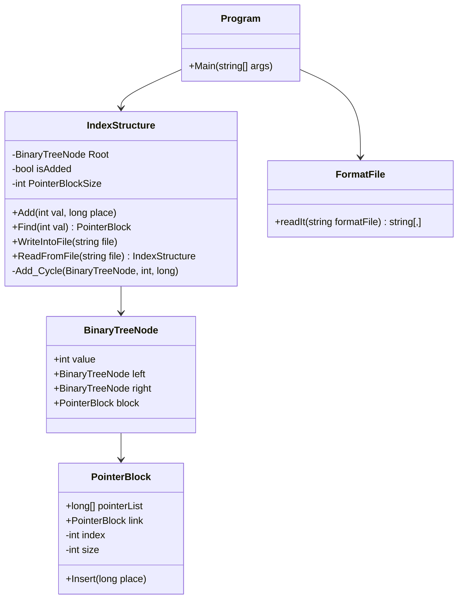

# Create Index (C#)

**A binary index file creator for fixed-length record databases. Reads a binary data file and a format descriptor, then builds a serialized B-tree-style index structure with pointer blocks.**

## Features

- **Binary Record Parsing**: Reads fixed-length records from a binary data file
- **Format File Descriptor**: CSV-based schema file defining field names, types, sizes
- **Binary Search Tree Index**: In-memory BST keyed on a specified field
- **Pointer Blocks**: Each tree node links to a pointer block (array of file positions), with overflow blocks for duplicate keys
- **.NET Binary Serialization**: Persists the entire index structure to disk

## Project Structure

```
create-index/
├── C_I.sln
├── C_I/
│   ├── Program.cs             # Entry point: parses args, builds index
│   ├── IndexStructure.cs      # BST index with Add/Find/Serialize
│   ├── BinaryTreeNode.cs      # BST node (value, left, right, pointer block)
│   ├── PointerBlock.cs        # Fixed-size pointer array with overflow chain
│   ├── FormatFile.cs          # Reads format definition file
│   ├── ClassDiagram1.cd       # Visual Studio class diagram
│   └── Properties/
│       └── AssemblyInfo.cs
└── README.md
```

## Class Diagram



## Algorithm Flow

```mermaid
flowchart TD
    A[Parse command-line args] --> B[Read format file]
    B --> C[Locate target field position<br>and total record size]
    C --> D[Open binary data file]
    D --> E[Seek to first record's key field]
    E --> F[Read key value]
    F --> G[Create IndexStructure with root node]
    G --> H[Seek past rest of record]
    H --> I{More records?}
    I -->|Yes| J[Read next key value]
    J --> K[IndexStructure.Add(key, position)]
    K --> H
    I -->|No| L[Serialize IndexStructure to output file]
```

## Core Concepts

### Index Structure

A **Binary Search Tree** serves as the primary index:

- Each **node** stores a unique key value
- Left subtree: all keys < node value
- Right subtree: all keys > node value

### Pointer Blocks

Each BST node has an associated **pointer block** — a fixed-size array of file positions (byte offsets) pointing to all records with that key value:

```
PointerBlock (size = N)
┌─────┬─────┬─────┬─────┬─────┬─────┐
│ pos │ pos │ pos │ ... │ pos │link─┼──→ PointerBlock (overflow)
└─────┴─────┴─────┴─────┴─────┴─────┘
```

- If a key appears more than `size` times, an **overflow block** (`link`) is created and chained
- This handles duplicate keys efficiently

### Format File

A CSV file defining the record structure:

```
field_name,data_type,field_size,decimals,null_allowed
ID,int,4,0,false
Name,string,20,0,true
Score,float,4,2,false
```

Each line: `name, type, byte_size, decimals, nullable`

### Serialization

The entire `IndexStructure` (including all tree nodes and pointer blocks) is serialized to disk using .NET `BinaryFormatter`. This allows the index to be persisted and loaded later with `ReadFromFile()`.

### Command Line Usage

```
C_I.exe <datafile> <formatfile> <key_field> <record_count> <pointer_block_size> <output_file>
```

| Argument | Description |
|---|---|
| `datafile` | Binary file with fixed-length records |
| `formatfile` | CSV format descriptor |
| `key_field` | Field name to index on |
| `record_count` | Total number of records |
| `pointer_block_size` | Max pointers per pointer block |
| `output_file` | Path for serialized index file |

### Example

```
C_I.exe data.bin format.txt ID 1000 5 index.dat
```

This reads `data.bin` (1000 records, format defined in `format.txt`), indexes on the `ID` field, uses pointer blocks of size 5, and writes the index to `index.dat`.

## Building

Open `C_I.sln` in Visual Studio 2008+ (retarget .NET Framework if needed) and build.
